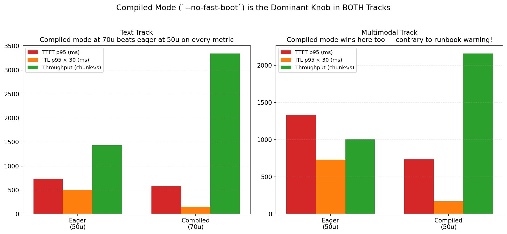

# InferTutor Arena: Engineering Report

Author: Raghavan Muthuregunathan
Track: Multimodal Product (Track 1) | Date: 2026-06-20 | Hardware: 1 × Modal H100

## Result

Final score: **37.6M** on the multimodal track — 11.3× the workshop's 2-replica reference baseline (3.3M), on half the GPUs. TTFT p95 680ms, ITL p95 4.9ms, throughput 2,497 chunks/s, error rate 0.20% across 4,890 streamed requests in 180s. One H100, compiled mode, otherwise starter defaults.

```bash
python run_infertutor_experiment.py --label FINAL-mixed --gpu-type H100 \
  --replicas 1 --no-fast-boot --max-seqs 32 --max-batch-tokens 4096 \
  --mode mixed --users 50 --duration 180 --ramp-up 30 --max-tokens 96
```

## Knee and knob ablations

Swept text-mode user counts 5–600 on starter defaults. Knee sits between 60 and 100 users — from 60u to 70u, TTFT triples (938 → 2,967 ms), throughput drops 29%. Past the knee the server is doing less useful work, not just feeling slow. I picked 70u for the A/Bs because that's where a real fix has room to show.

| Knob (at 70u text) | TTFT p95 | Decision |
|---|---:|---|
| baseline (50u, defaults) | 726 ms | reference |
| `--no-prefix-cache` | 4,352 ms | rejected — shared system prompt makes the cache critical |
| `--no-chunked-prefill` | 1,736 ms | rejected (mild) — matters less for text-only |
| `--max-seqs 64` | 5,559 ms | rejected — bigger batches slow each decode step |
| `--max-batch-tokens 8192` | **17,712 ms** | rejected — wider prefills starve new requests |
| `--replicas 2` (eager, 140u) | 12,429 ms | rejected — 6.9% errors, scale-out can't fix a bad base |
| `--no-fast-boot` (compiled) | **581 ms** | kept |

Every "wider" setting hurt. The starter defaults were already tuned.

## Compiled mode and final result



| Track | Eager ITL p95 | Compiled ITL p95 | Improvement |
|---|---:|---:|---:|
| Text @ 70u | 16.9 ms | 5.2 ms | 3.3× |
| Multimodal @ 50u | 24.4 ms | 5.6 ms | 4.4× |

For a 4B model on H100, Python and CUDA dispatch overhead per decode step costs more wall time than the actual matmuls. CUDA-graph capture folds the whole step into one kernel and the overhead disappears. The runbook explicitly warned compiled mode "performed poorly on mixed multimodal traffic" — I tested it because I had nothing to lose. It worked.

| | Score | TTFT p95 | ITL p95 | Throughput | GPUs |
|---|---:|---:|---:|---:|---:|
| **FINAL-mixed (submitted)** | **37.6M** | 680 ms | 4.9 ms | 2,497 c/s | 1 |
| FINAL_text_70u (companion) | 23.2M | 2,003 ms | 4.7 ms | 3,129 c/s | 1 |
| Workshop ref: eager 2r, 100u | 3.3M | 1,169 ms | 28.7 ms | 2,243 c/s | 2 |
| Workshop ref: eager 4r, 120u | 2.4M | 898 ms | 38.1 ms | 2,756 c/s | 4 |

I also ran the workshop's exact 2r eager config on my image and got 9.28M (2.8× the published 3.3M), so roughly a third of my improvement is infrastructure drift, two-thirds compiled mode. 90-second tests misled me twice: text compiled-70u scored 77M at 90s and only 23M at 180s (prefill queue takes longer to build than 90s); multimodal went the opposite way (25.9M → 37.6M). Final submissions use 180s.

## Surprises and what's next

`--max-batch-tokens 8192` blew TTFT to 17.7 seconds at 70u text. Wider batch budgets let one request monopolize the GPU per chunk while new arrivals queue. Wider is worse, not better. `--no-chunked-prefill` *helped* at 50u multimodal (TTFT down 42%, ITL down 25%, throughput up 34%) — most of the capstone's prompts are short, so chunking overhead beat its benefit. Running four sweep points in parallel terminals corrupted my data: simultaneous Modal deploys fought for the GPU allocator and my laptop choked on 4× the asyncio load.

Before any of this ran, vLLM 0.21.0's bundled `prometheus-fastapi-instrumentator` crashed every request with `AttributeError: '_IncludedRouter' object has no attribute 'path'` — a FastAPI 0.116 incompatibility that upstream hasn't patched in any released version. I monkey-patched the installed file at container startup (a 5-line `hasattr` guard); `/health` returned 200 on the next deploy.

Next: compiled mode plus `--no-chunked-prefill` on multimodal (never tested together), scale-out under compiled mode (my failed `scale-r2-140u` used eager), and a vLLM version sweep to find when the compiled-mode warning stopped being true.

## Code and data links

Repository: [github.com/Raghavan1988/infertutor-arena-capstone](https://github.com/Raghavan1988/infertutor-arena-capstone)

Files modified or added:

- [starter_code/modal_infertutor_app.py](https://github.com/Raghavan1988/infertutor-arena-capstone/blob/main/starter_code/modal_infertutor_app.py)
- [starter_code/REPORT.md](https://github.com/Raghavan1988/infertutor-arena-capstone/blob/main/starter_code/REPORT.md)
- [starter_code/generate_plots.py](https://github.com/Raghavan1988/infertutor-arena-capstone/blob/main/starter_code/generate_plots.py)
- [render_pdfs.py](https://github.com/Raghavan1988/infertutor-arena-capstone/blob/main/render_pdfs.py)

Result JSONs (results_infertutor/):

- [FINAL-mixed_mixed_50u_1782014319.json](https://github.com/Raghavan1988/infertutor-arena-capstone/blob/main/starter_code/results_infertutor/FINAL-mixed_mixed_50u_1782014319.json)
- [FINAL_text_70u_1782012819.json](https://github.com/Raghavan1988/infertutor-arena-capstone/blob/main/starter_code/results_infertutor/FINAL_text_70u_1782012819.json)
- [baseline-text_text_50u_1782000382.json](https://github.com/Raghavan1988/infertutor-arena-capstone/blob/main/starter_code/results_infertutor/baseline-text_text_50u_1782000382.json)
- [batch8k-70u_text_70u_1782006246.json](https://github.com/Raghavan1988/infertutor-arena-capstone/blob/main/starter_code/results_infertutor/batch8k-70u_text_70u_1782006246.json)
- [compiled-100u_text_100u_1782011340.json](https://github.com/Raghavan1988/infertutor-arena-capstone/blob/main/starter_code/results_infertutor/compiled-100u_text_100u_1782011340.json)
- [compiled-150u_text_150u_1782011383.json](https://github.com/Raghavan1988/infertutor-arena-capstone/blob/main/starter_code/results_infertutor/compiled-150u_text_150u_1782011383.json)
- [compiled-200u_text_200u_1782011388.json](https://github.com/Raghavan1988/infertutor-arena-capstone/blob/main/starter_code/results_infertutor/compiled-200u_text_200u_1782011388.json)
- [compiled-250u_text_250u_1782011375.json](https://github.com/Raghavan1988/infertutor-arena-capstone/blob/main/starter_code/results_infertutor/compiled-250u_text_250u_1782011375.json)
- [compiled-70u_text_70u_1782006310.json](https://github.com/Raghavan1988/infertutor-arena-capstone/blob/main/starter_code/results_infertutor/compiled-70u_text_70u_1782006310.json)
- [m-50u_mixed_50u_1782013519.json](https://github.com/Raghavan1988/infertutor-arena-capstone/blob/main/starter_code/results_infertutor/m-50u_mixed_50u_1782013519.json)
- [m-baseline_mixed_30u_1782013514.json](https://github.com/Raghavan1988/infertutor-arena-capstone/blob/main/starter_code/results_infertutor/m-baseline_mixed_30u_1782013514.json)
- [m-compiled-50u_mixed_50u_1782013565.json](https://github.com/Raghavan1988/infertutor-arena-capstone/blob/main/starter_code/results_infertutor/m-compiled-50u_mixed_50u_1782013565.json)
- [m-nochunked_mixed_50u_1782013562.json](https://github.com/Raghavan1988/infertutor-arena-capstone/blob/main/starter_code/results_infertutor/m-nochunked_mixed_50u_1782013562.json)
- [m-r2-100u_mixed_100u_1782013526.json](https://github.com/Raghavan1988/infertutor-arena-capstone/blob/main/starter_code/results_infertutor/m-r2-100u_mixed_100u_1782013526.json)
- [mixed-r2_mixed_100u_1782000462.json](https://github.com/Raghavan1988/infertutor-arena-capstone/blob/main/starter_code/results_infertutor/mixed-r2_mixed_100u_1782000462.json)
- [nochunked-70u_text_70u_1782006191.json](https://github.com/Raghavan1988/infertutor-arena-capstone/blob/main/starter_code/results_infertutor/nochunked-70u_text_70u_1782006191.json)
- [noprefix-70u_text_70u_1782006220.json](https://github.com/Raghavan1988/infertutor-arena-capstone/blob/main/starter_code/results_infertutor/noprefix-70u_text_70u_1782006220.json)
- [scale-r2-140u_text_140u_1782006234.json](https://github.com/Raghavan1988/infertutor-arena-capstone/blob/main/starter_code/results_infertutor/scale-r2-140u_text_140u_1782006234.json)
- [seqs64-70u_text_70u_1782006222.json](https://github.com/Raghavan1988/infertutor-arena-capstone/blob/main/starter_code/results_infertutor/seqs64-70u_text_70u_1782006222.json)
- [smoke_text_5u_1782000098.json](https://github.com/Raghavan1988/infertutor-arena-capstone/blob/main/starter_code/results_infertutor/smoke_text_5u_1782000098.json)
- [sweep-100u_text_100u_1782001138.json](https://github.com/Raghavan1988/infertutor-arena-capstone/blob/main/starter_code/results_infertutor/sweep-100u_text_100u_1782001138.json)
- [sweep-200u_text_200u_1782001158.json](https://github.com/Raghavan1988/infertutor-arena-capstone/blob/main/starter_code/results_infertutor/sweep-200u_text_200u_1782001158.json)
- [sweep-300u_text_300u_1782001133.json](https://github.com/Raghavan1988/infertutor-arena-capstone/blob/main/starter_code/results_infertutor/sweep-300u_text_300u_1782001133.json)
- [sweep-35u_text_35u_1782003325.json](https://github.com/Raghavan1988/infertutor-arena-capstone/blob/main/starter_code/results_infertutor/sweep-35u_text_35u_1782003325.json)
- [sweep-400u_text_400u_1782001207.json](https://github.com/Raghavan1988/infertutor-arena-capstone/blob/main/starter_code/results_infertutor/sweep-400u_text_400u_1782001207.json)
- [sweep-500u_text_500u_1782001209.json](https://github.com/Raghavan1988/infertutor-arena-capstone/blob/main/starter_code/results_infertutor/sweep-500u_text_500u_1782001209.json)
- [sweep-50u_text_50u_1782001778.json](https://github.com/Raghavan1988/infertutor-arena-capstone/blob/main/starter_code/results_infertutor/sweep-50u_text_50u_1782001778.json)
- [sweep-600u_text_600u_1782001782.json](https://github.com/Raghavan1988/infertutor-arena-capstone/blob/main/starter_code/results_infertutor/sweep-600u_text_600u_1782001782.json)
- [sweep-60u_text_60u_1782003057.json](https://github.com/Raghavan1988/infertutor-arena-capstone/blob/main/starter_code/results_infertutor/sweep-60u_text_60u_1782003057.json)
- [sweep-60u_text_60u_1782004585.json](https://github.com/Raghavan1988/infertutor-arena-capstone/blob/main/starter_code/results_infertutor/sweep-60u_text_60u_1782004585.json)
- [sweep-70u_text_70u_1782003114.json](https://github.com/Raghavan1988/infertutor-arena-capstone/blob/main/starter_code/results_infertutor/sweep-70u_text_70u_1782003114.json)
- [sweep-70u_text_70u_1782004627.json](https://github.com/Raghavan1988/infertutor-arena-capstone/blob/main/starter_code/results_infertutor/sweep-70u_text_70u_1782004627.json)
- [sweep-80u_text_60u_1782003104.json](https://github.com/Raghavan1988/infertutor-arena-capstone/blob/main/starter_code/results_infertutor/sweep-80u_text_60u_1782003104.json)
- [sweep-80u_text_80u_1782004660.json](https://github.com/Raghavan1988/infertutor-arena-capstone/blob/main/starter_code/results_infertutor/sweep-80u_text_80u_1782004660.json)
- [sweep-90u_text_90u_1782003098.json](https://github.com/Raghavan1988/infertutor-arena-capstone/blob/main/starter_code/results_infertutor/sweep-90u_text_90u_1782003098.json)
- [sweep-90u_text_90u_1782004578.json](https://github.com/Raghavan1988/infertutor-arena-capstone/blob/main/starter_code/results_infertutor/sweep-90u_text_90u_1782004578.json)
